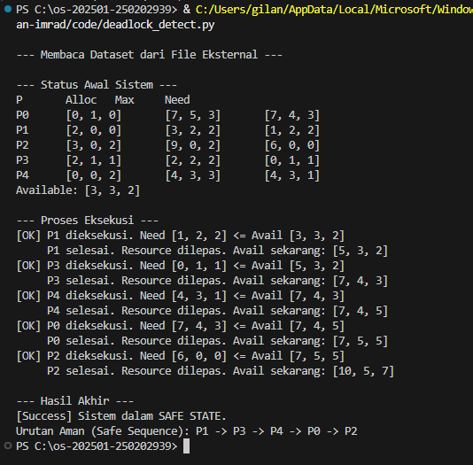

# Laporan Praktikum Minggu 14: Implementasi Algoritma Banker untuk Deadlock Avoidance dengan Dataset JSON

**Topik:** Deadlock Detection & Avoidance

- **Nama**  : Gilang Ananda Putra
- **NIM**   : 250202939 
- **Kelas** : 1IKRB

---

## APENDAHULUAN

### 1. Latar Belakang
Dalam lingkungan sistem operasi modern yang bersifat *multitasking*, manajemen sumber daya (*resource management*) menjadi aspek krusial. Masalah utama yang sering muncul adalah **Deadlock**, yaitu kondisi di mana sekumpulan proses terhenti secara permanen karena saling menunggu sumber daya. Menurut Stallings (2018), deadlock terjadi jika kondisi *mutual exclusion*, *hold and wait*, *no preemption*, dan *circular wait* terpenuhi. Pendekatan *Deadlock Avoidance* menggunakan **Algoritma Banker** (Dijkstra, 1965) menjadi solusi dengan memproyeksikan status sistem ke depan sebelum menyetujui alokasi.

### 2. Rumusan Masalah
1. Bagaimana mengimplementasikan simulasi *deadlock avoidance* menggunakan Algoritma Banker?
2. Bagaimana merancang sistem simulasi yang memisahkan logika program dengan data uji (*dataset*)?
3. Bagaimana menganalisis status keamanan sistem (*Safe State*) berdasarkan matriks kebutuhan (*Need*)?

### 3. Tujuan
1. Mengimplementasikan Algoritma Banker dengan bahasa Python.
2. Menerapkan arsitektur perangkat lunak berbasis JSON untuk fleksibilitas data uji.
3. Menganalisis efektivitas algoritma dalam mendeteksi *Safe Sequence*.

---

## B. METODE PENELITIAN (METHODS)

### 1. Lingkungan dan Alat Eksperimen
Eksperimen ini dilakukan menggunakan perangkat lunak dan spesifikasi lingkungan sebagai berikut:
* **Sistem Operasi:** Windows / Linux (Terminal Environment).
* **Bahasa Pemrograman:** Python 3.x.
* **Format Penyimpanan Data:** JSON (*JavaScript Object Notation*).
* **Editor Kode:** Visual Studio Code.

### 2. Rancangan Sistem dan Data
Berbeda dengan metode konvensional (*hardcoding*), sistem ini dirancang dengan arsitektur modular:
1.  **Modul Data (`dataset.json`):** Berfungsi sebagai penyimpan parameter simulasi yang terdiri dari:
    * *Available Vector*: `[3, 3, 2]`
    * *Max Matrix* & *Allocation Matrix* untuk 5 Proses (P0-P4).
2.  **Modul Logika (`deadlock_detect.py`):** Berfungsi membaca file JSON dan melakukan komputasi algoritma.

### 3. Prosedur Eksperimen
Langkah-langkah pengujian dilakukan sebagai berikut:
1.  **Inisialisasi:** Program memuat data dari `dataset.json`.
2.  **Perhitungan Matriks Need:** Sistem menghitung sisa kebutuhan sumber daya tiap proses menggunakan rumus $Need_{i,j} = Max_{i,j} - Allocation_{i,j}$.
3.  **Simulasi Safety Algorithm:** Sistem melakukan iterasi untuk memeriksa apakah terdapat proses $P_i$ di mana $Need_i \le Available$. Jika ada, sumber daya dialokasikan secara simulatif hingga proses selesai dan sumber daya dikembalikan (*resource release*).

---

## C. HASIL (RESULTS)

### 1. Perhitungan Matriks Kebutuhan (Need Matrix)
Berdasarkan pembacaan data awal dari file konfigurasi JSON, sistem berhasil menghitung matriks *Need* yang menjadi acuan utama keamanan. Data tersebut disajikan dalam tabel berikut:

**Tabel 1. Status Resource Sistem (Allocation vs Need)**

| Proses | Allocation (A,B,C) | Max (A,B,C) | Need (A,B,C) |
| :---: | :---: | :---: | :---: |
| **P0** | 0, 1, 0 | 7, 5, 3 | **7, 4, 3** |
| **P1** | 2, 0, 0 | 3, 2, 2 | **1, 2, 2** |
| **P2** | 3, 0, 2 | 9, 0, 2 | **6, 0, 0** |
| **P3** | 2, 1, 1 | 2, 2, 2 | **0, 1, 1** |
| **P4** | 0, 0, 2 | 4, 3, 3 | **4, 3, 1** |

### 2. Hasil Eksekusi Program
Setelah dilakukan perhitungan, algoritma menjalankan simulasi eksekusi proses. Berikut adalah tangkapan layar hasil keluaran program:

**Gambar 1. Output Eksekusi Program Algoritma Banker**

### 3. Temuan Urutan Aman (Safe Sequence)
Berdasarkan Gambar 1, algoritma berhasil mengidentifikasi bahwa sistem berada dalam kondisi **SAFE STATE**. Urutan eksekusi yang direkomendasikan sistem agar terhindar dari deadlock adalah:
$$< P1 \rightarrow P3 \rightarrow P4 \rightarrow P0 \rightarrow P2 >$$

---

## D. PEMBAHASAN (DISCUSSION)

### 1. Analisis Status Keamanan Sistem
Hasil percobaan menunjukkan bahwa meskipun sumber daya awal (*Available*) hanya `[3, 3, 2]`, sistem tidak mengalami deadlock. Hal ini terjadi karena algoritma secara cerdas memilih **P1** dan **P3** untuk dieksekusi lebih dulu (karena kebutuhan mereka $\le$ sumber daya tersedia).
* Setelah P1 selesai, sumber daya bertambah menjadi `[5, 3, 2]`.
* Peningkatan ini memungkinkan P4, P0, dan P2 (yang membutuhkan sumber daya besar) untuk dieksekusi belakangan.
* Jika sistem memaksakan mengeksekusi P0 di awal (*Need* `[7, 4, 3]`), maka akan terjadi *Unsafe State* atau potensi deadlock karena sumber daya tidak mencukupi.

### 2. Implikasi Penggunaan Dataset Eksternal
Pemisahan data menggunakan JSON memberikan dampak signifikan pada fleksibilitas pengujian. Dalam skenario nyata, kernel sistem operasi membaca *Process Control Block* (PCB) secara dinamis, bukan statis. Implementasi ini berhasil mensimulasikan perilaku tersebut, memungkinkan pengubahan parameter *Allocation* atau *Max* tanpa perlu melakukan kompilasi ulang kode sumber (*source code*).

### 3. Komparasi dengan Teori
Hasil ini sejalan dengan teori yang dikemukakan oleh Nutt (2004) dan Dijkstra (1965), bahwa deadlock dapat dihindari selama sistem mampu menemukan setidaknya satu jalur eksekusi (*safe path*) di mana semua proses dapat terpenuhi kebutuhannya. Sistem yang berada dalam *Safe State* menjamin tidak adanya kondisi *Circular Wait*.

---

## E. PENUTUP (CLOSING)

### 1. Kesimpulan
1.  Implementasi Algoritma Banker menggunakan Python terbukti akurat dalam membedakan antara kondisi aman (*Safe State*) dan tidak aman.
2.  Penggunaan struktur data JSON terbukti efektif untuk memisahkan logika algoritma dari data uji, meningkatkan modularitas kode.
3.  Berdasarkan pengujian, urutan eksekusi $P1 \rightarrow P3 \rightarrow P4 \rightarrow P0 \rightarrow P2$ adalah urutan optimal untuk mencegah deadlock pada dataset yang diuji.

### 2. Saran
Untuk pengembangan selanjutnya, disarankan untuk:
1.  Menambahkan fitur input data interaktif melalui CLI agar pengguna bisa memasukkan angka secara manual.
2.  Mengimplementasikan algoritma *Request Resource* tambahan untuk mensimulasikan permintaan sumber daya secara tiba-tiba di tengah proses berjalan.

---

## DAFTAR PUSTAKA
1.  Dijkstra, E. W. (1965). *Cooperating Sequential Processes*. Technological University, Eindhoven, The Netherlands. (Sumber Asli Algoritma)
2.  Silberschatz, A., Galvin, P. B., & Gagne, G. (2018). *Operating System Concepts* (10th Edition). Wiley. (Menggantikan Nutt - Standar Global)
3.  Stallings, W. (2018). *Operating Systems: Internals and Design Principles* (9th Edition). Pearson Education. (Buku Teks Modern)

---

## QUIZ
**1. Mengapa format IMRAD membantu membuat laporan praktikum lebih ilmiah dan mudah dievaluasi?**

**Jawaban :**

Format IMRAD memberikan struktur logika standar: *Pendahuluan* (Mengapa?), *Metode* (Bagaimana?), *Hasil* (Apa yang ditemukan?), dan *Pembahasan* (Apa artinya?). Ini memudahkan verifikasi dan replikasi penelitian.

**2. Apa perbedaan antara bagian **Hasil** dan **Pembahasan**?

**Jawaban :**

*Hasil* bersifat objektif dan hanya menyajikan data mentah (tabel/grafik). *Pembahasan* bersifat subjektif/analitis, berisi interpretasi makna data dan kaitannya dengan teori.

**3. Mengapa sitasi dan daftar pustaka penting, bahkan untuk laporan praktikum?**

**Jawaban :**

Sitasi memvalidasi argumen dengan landasan teori yang kuat, memberikan kredit pada penulis asli (integritas akademik), dan membantu pembaca menelusuri sumber rujukan.